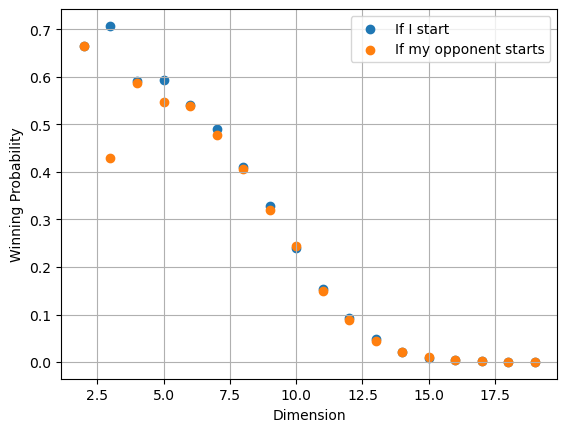
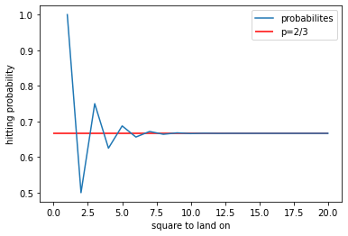
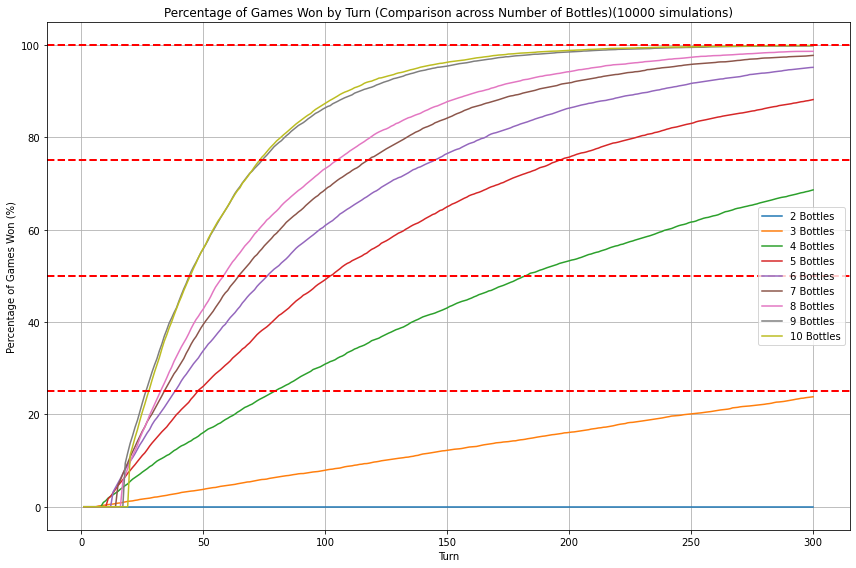

# Python Problem Solving & Computational Mathematics

This repository contains selected Python coursework from my third-year **Problem Solving with Python** module during my BSc Mathematics at the University of Warwick.

The work applies Python to mathematical puzzles, stochastic simulation, recurrence relations, numerical experimentation and visualisation. The notebooks are intentionally kept close to their original exploratory form, but the repository has been organised to make the computational ideas clear to recruiters and technical reviewers.

---

## Project Overview

Across five assignments and one larger mini-project, I used Python to investigate mathematical problems by combining simulation, recurrence relations and visual analysis.

The notebooks demonstrate:

* Monte Carlo simulation
* Random processes and probability estimation
* Recurrence relations and difference equations
* Matrix-based numerical experiments
* Data visualisation with Matplotlib
* Exploratory computational problem solving
* Translating mathematical reasoning into working Python code

---

## Repository Structure

```text
.
├── README.md
├── requirements.txt
├── notebooks/
│   ├── assignment_1_recurrence_periods_mod_10.ipynb
│   ├── assignment_2_random_matrix_game.ipynb
│   ├── assignment_3_random_hat_game.ipynb
│   ├── assignment_4_random_walk_hitting_probability.ipynb
│   ├── assignment_5_spiral_walk_distance.ipynb
│   └── mini_project_water_bottle_game.ipynb
├── figures/
│   ├── assignment_2_winning_probability_by_dimension.png
│   ├── assignment_4_hitting_probability_convergence.png
│   └── mini_project_win_probability_by_turn.png
└── mini_project_water_bottle_game_report.pdf
```

---

## Assignment Summaries

### Assignment 1: Recurrence Periods Modulo 10

This notebook investigates a Fibonacci-style recurrence where each new term is calculated from the previous two terms modulo 10.

For every possible starting pair `(a, b)` with digits from 0 to 9, the code computes how long it takes before the recurrence returns to a previously seen pair. This provides a computational exploration of periodic behaviour in modular recurrence sequences.

---

### Assignment 2: Random Matrix Game

This notebook estimates the probability of winning a matrix-based game using randomly generated binary matrices.

For each matrix dimension, the code constructs matrices of zeros and ones, computes their determinants, and estimates winning probabilities through repeated simulation.

**Key concepts:**

* Monte Carlo simulation
* Linear algebra
* Determinant computation
* Probability estimation

#### Example Output



---

### Assignment 3: Random Hat Game

This notebook simulates a random number game where two numbers are repeatedly selected and replaced by their absolute difference until only one value remains.

The project investigates the distribution of final outcomes through large-scale simulation and empirical experimentation.

**Key concepts:**

* Random processes
* Histogram analysis
* Simulation-based hypothesis testing

---

### Assignment 4: Random Walk Hitting Probability

This notebook studies a random walk in which each step has size 1 or 2.

The goal is to estimate the probability that the walk lands exactly on a target square and compare simulation results with a recurrence-based theoretical model.

**Key concepts:**

* Random walks
* Recurrence relations
* Probability convergence
* Numerical experimentation

#### Example Output



---

### Assignment 5: Spiral Walk Distance

This notebook simulates movement along a square spiral and measures distance from the origin after each step.

The resulting data is analysed using polynomial curve fitting to investigate growth behaviour.

**Key concepts:**

* Coordinate geometry
* Curve fitting
* Numerical modelling
* Data visualisation

---

## Mini-Project: Water Bottle Game Simulation

The larger mini-project investigates a stochastic water bottle game involving two players.

* Player A distributes water across bottles.
* Player B randomly empties adjacent bottles.
* The game continues until a bottle exceeds an overfilling threshold.

The notebook combines Monte Carlo simulation with difference-equation analysis to investigate how different strategies influence the probability of winning.

**Key concepts:**

* Monte Carlo simulation
* Strategy analysis
* Difference equations
* Stochastic processes
* Visualisation and experimentation

#### Example Output



The accompanying report describing the mathematical modelling and experimental results is included in the repository.

---

## Technologies Used

* Python
* NumPy
* Matplotlib
* Jupyter Notebook

---

## Running the Notebooks

Install the required packages:

```bash
pip install -r requirements.txt
```

Then launch Jupyter Notebook:

```bash
jupyter notebook
```

---

## What I Learned

This module strengthened my ability to transform mathematical ideas into computational experiments. In particular, it developed my skills in simulation, numerical analysis, data visualisation and algorithmic problem solving, while reinforcing the connection between mathematical theory and practical programming.
